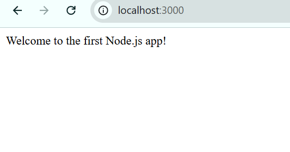

## Some notes:

- I installed [`nvm-windows`](https://github.com/coreybutler/nvm-windows) as a `Node.js` version manager (it is a highly recommended alternative to the original `nvm` for Windows systems  
though it is not a direct clone);
- I chose CommonJS over ESM to try something new (though I still prefer `ESM`);
- To start the project use `node index.js` after `npm install`.

## Results:

